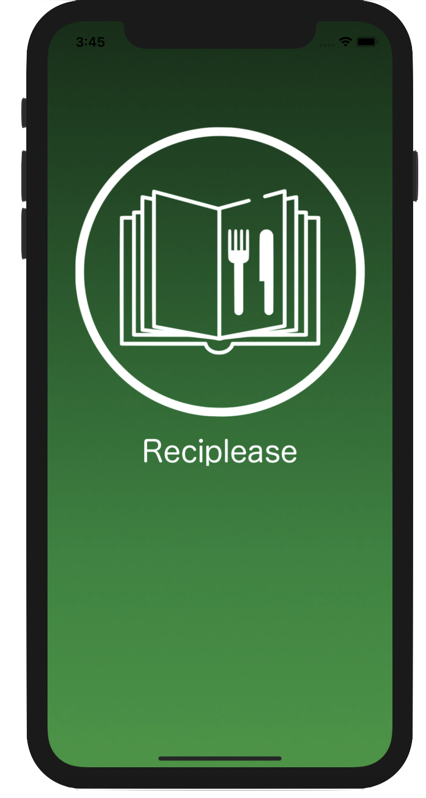
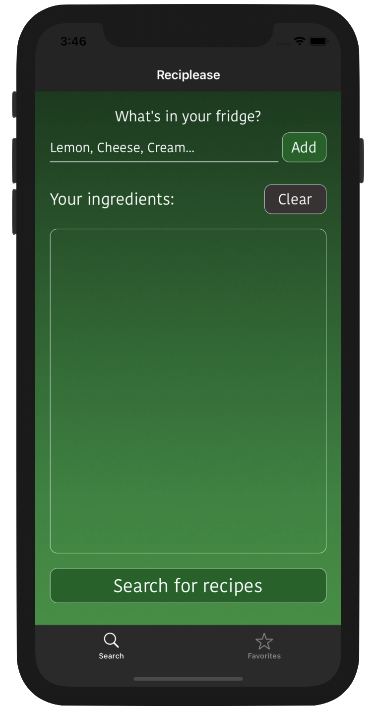
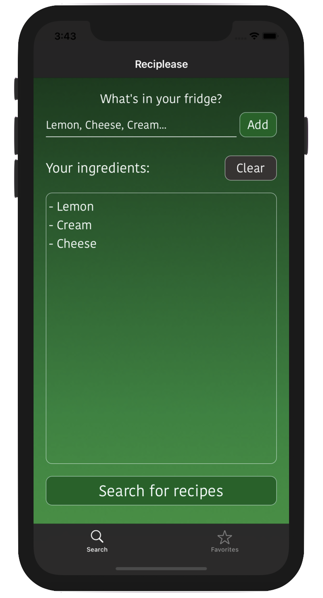
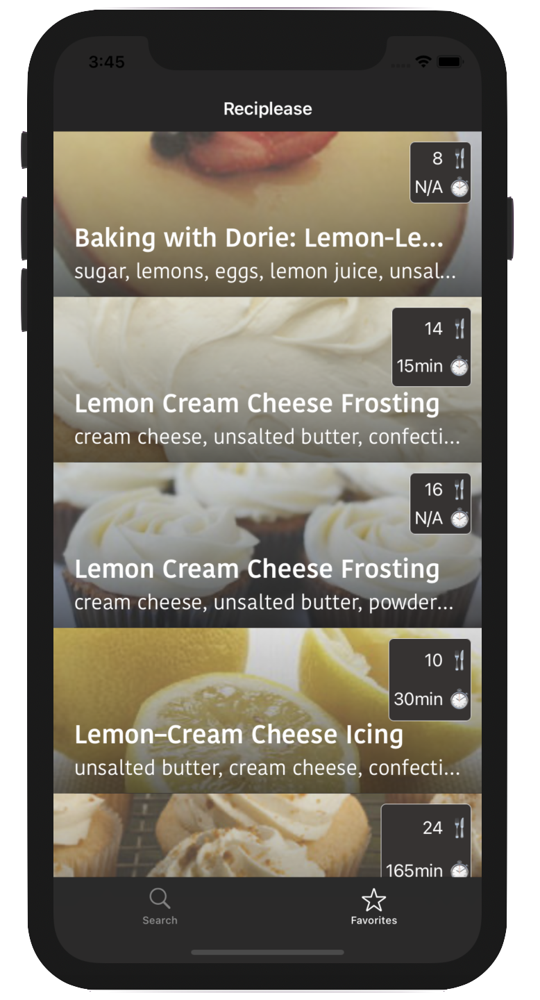
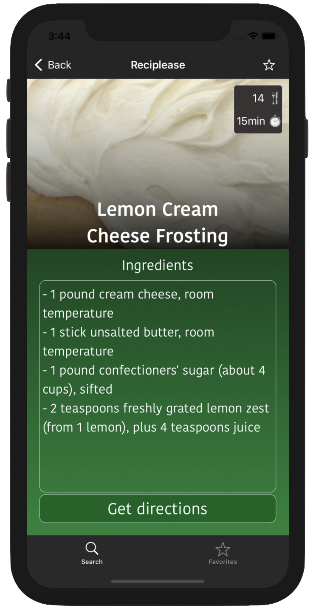
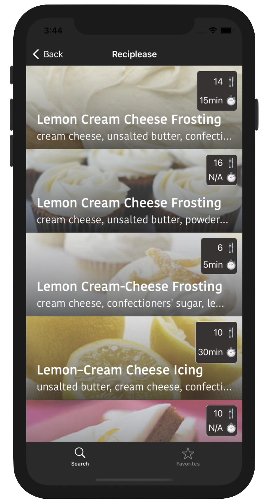
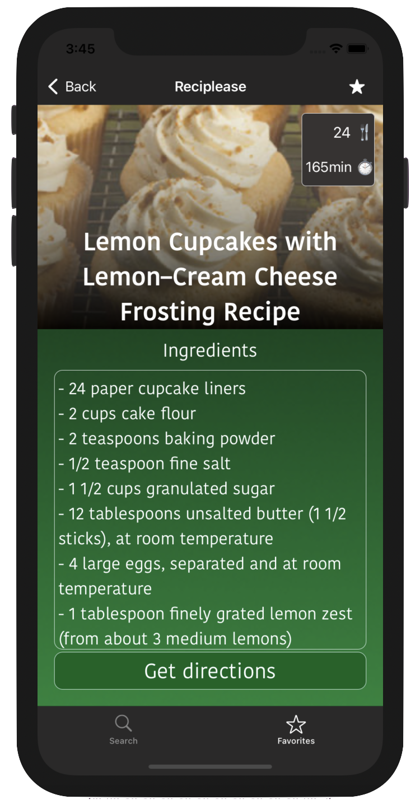

# Reciplease

**Reciplease** is a multi-pages iOS recipes application that allows user to search for recipes from what they have in their fridge, and to save favorite recipes for later.

 

## Version

Current version : V2.
Supports iOS 14.1+. 
Available in portrait mode on iPhone.
**Unit tests : ✓**

## API

The [Edamam](https://www.edamam.com) API is used to search for recipes.

## Data persistence
[CoreData](https://developer.apple.com/documentation/coredata) is used to manage and save data.

## Functionalities

- [x] Search for recipes by entering ingredients names

- [x] Build an ingredient list 

- [x] Obtain infos such as the number of servings and time of preparation for each recipe

- [x] See exact list of ingredients with quantities for each recipe

- [x] Access the directions website for each recipe

- [x] Save favorites recipes

## Ingredients

When launching the application, the user is greeted by the ingredient page, that allows them to enter the ingredients they have at home.

On this page, the user can either initiate the search by tapping on the 'Search for recipes' button, or clear their ingredient list to build another by tapping on the 'Clear' button.

## Search Results

When initiating the search, the user access the second page of the application : here, they can see all the recipes that matches their search inside a TableView, with informations such as the recipe name, the ingredients preview, a picture, the servings and the time of preparation of the recipes.

## Result Details

When tapping on a result, the user access the page of the recipe's details : here, they can see the full ingredients list with measurements. By clicking on the 'Get directions' button, they can access the website of the recipe to see the full directions.
They can also tap on the star icon, on the top right of the screen, to add to/delete from their favorites.

## Favorites

When tapping on the 'Favorites' icon in the tab bar, the user access their saved favorites : it is the exact same screen as the results page, but it contains all their saved favorites.

## Favorite Details

When tapping on a favorite, the user access its details page : here, they can see and do the exact same thing as the result details page.

> Written with [StackEdit](https://stackedit.io/).
